# Математика
- [Тема 28: Симетрични оператори в крайномерни евклидови пространства. Основни свойства. Теорема за диагонализация.](Тема%2028)
- [Тема 29: Симетрична и алтернативна група. Теорема на Кейли. Теорема за хомоморфизмите на групи.](Тема%2029)
- [Тема 30: Теорема на Ферма. Теореми за средните стойности (Рол, Лагранж и Коши). Формула на Тейлър.](Тема%2030)
- [Тема 31: Определен интеграл. Дефиниция и свойства. Интегруемост на непрекъснатите функции. Теорема на Нютон - Лайбниц.](Тема%2031)
- [Тема 32: Уравнения на права в равнината.](Тема%2032)
- [Тема 33: Уравнения на права и равнина в пространството.](Тема%2033)
- [Тема 34: Итерационни методи за решаване на нелинейни уравнения.](Тема%2034)
- [Тема 35: Дискретни разпределения. Равномерно, биномно, геометрично и Поасоново разпределение. Задачи, в които възникват. Моменти – математическо очакване и дисперсия.](Тема%2035)

# Как се смятат детерминанти?
- 1x1 - тривиално е, колега
- 2x2 - твириално е, колега
- 3x3
  - Сарус (триъгълници)
    
  - Сарус (разширение)
    
  - Адюнгирани количества
    
